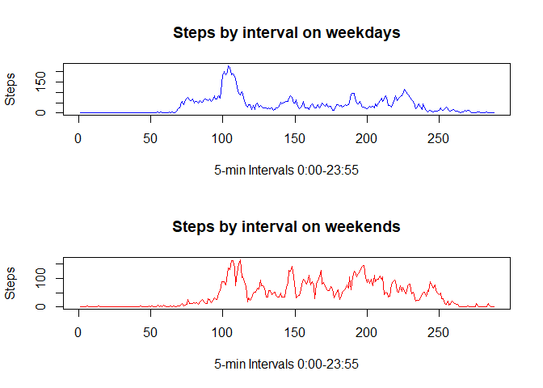

This is the first of two peer-graded projects for the reproducible research. Completing it requires us to generate an **R markdown document** that will load and analyze a dataset, as well as explain what it is we're doing during the various steps. This submission is what it looks like when *I* ~~try to~~ create such a document.

## Loading and preprocessing the data
 For starters, let's grab the file provided in the course materials and load it into R:

```r
temp <- tempfile() # sets up a temporary file for the zipped dataset
url <- "https://d396qusza40orc.cloudfront.net/repdata%2Fdata%2Factivity.zip"
    # above URL given in course materials
download.file(url, temp) # assigns the zipped dataset to temp
dataset <- read.csv(unz(temp, "activity.csv"))

unlink(temp)
```
    The variable `dataset` now holds the entire `activity.csv` file we loaded in as a data frame.
## What is mean total number of steps taken per day?
    This is fairly straightforward to answer. The `steps` column of `dataset` is an integer object already, so we can run `mean()` on it directly, provided we drop the NA values to give the function a meaningful result. A 1440-minute day divides into 288 five-minute intervals, so we'll break the vector of steps up into groups of 288:

```r
dailysteps <- rep(0, length(unique(dataset$date)))
for(i in 1:length(dailysteps)){
  dailysteps[i] <- sum(dataset$steps[(288 * (i - 1) + 1):(288 * i)], na.rm = TRUE)
}

mean(dailysteps, na.rm = TRUE)
```

```
## [1] 9354.23
```
    We've divided the 17568 observations we started with into 61 days and summed them, and then taken the mean of those sums. 9354 steps per day, assuming a 30-inch step, works out to walking a bit less than four and a half miles each day.
    
###Histogram
    The mean isn't the only thing about `steps` that we're interested in, though. We also want a histogram of the number of steps to give us an idea of what sort of distribution we're looking at. This is pretty easy to do with base graphics:

```r
hist(dailysteps, main = "Number of steps per day",
     xlab = "Total steps", col = "green", breaks = 10)
```

<!-- -->

###Other descriptive statistics
    The course materials also ask us to calculate and report the mean and median of the total number of steps taken per day. Having broken the `steps` column into the `dailysteps` variable, this is easy now:

```r
paste("The mean is", mean(dailysteps, na.rm = TRUE), "and the median is", median(dailysteps, na.rm = TRUE))
```

```
## [1] "The mean is 9354.22950819672 and the median is 10395"
```
## What is the average daily activity pattern?
    Beyond the histogram, median and mean, the assignment asks us to make several other calculations based on this data. The first of these is a time series plot of average activity in a given interval over all days in the dataset:
<!-- -->

###The interval with the maximum number of steps, on average
    It's not really any trickier to split the observations up by interval than by day. We will split the observations into a matrix with 288 rows (one for each interval throughout the day) and 61 columns (one for each day in the period studied), and from there we can directly check the means for the various intervals and compare them.

```r
byinterval <- matrix(dataset$steps, nrow = 288, byrow = FALSE)
intervalmeans <- rep(0,288)
for(i in 1:288){ intervalmeans[i] <- mean(byinterval[i, ], na.rm = TRUE) }
which.max(intervalmeans)
```

```
## [1] 104
```
The 104th interval (8:35a-8:39a) has, on average, more steps than any other.

## Imputing missing values
    Our first assigned task here is to determine how many missing values there are to impute. This only takes one line:

```r
sum(is.na(dataset$steps))
```

```
## [1] 2304
```
    We have 2304 missing values, or roughly 13 percent of the total. We will impute these by inserting the average value of `steps` for the given interval. We will copy our original dataset before imputing so that we can easily and directly compare descriptive statistics from before and after the imputation:

```r
newdata <- dataset
for(i in 1:length(newdata$steps)){
  time <- newdata$interval[i]
  if(is.na(newdata$steps[i]) == TRUE){
    newdata$steps[i] <- mean(subset(newdata$steps, 
                                    newdata$interval == time), na.rm = TRUE)
  }
}
```
###Did the imputation affect estimates of step totals?
    Having filled in the missing values, it's important to determine how much impact the filling-in procedure may have had on the overall picture of the data. We will do this first by a histogram (requiring us to once again divide the imputed dataset by dates):

```r
newdailysteps <- rep(0, length(unique(newdata$date)))
for(i in 1:length(newdailysteps)){
  newdailysteps[i] <- sum(newdata$steps[(288 * (i - 1) + 1):(288 * i)], na.rm = TRUE)
}

hist(newdailysteps, main = "Number of steps per day after imputation",
     xlab = "Total steps", col = "green", breaks = 10)
```

<!-- -->
    At least one effect is immediately obvious: the bins at the extremes of the histogram both have significantly more observations in them. Now let's see if we can resolve a difference using the median and mean of the datasets, before and after imputation:

```r
paste("With missing values omitted, the mean is", mean(dailysteps, na.rm = TRUE), "and the median is", median(dailysteps, na.rm = TRUE))
```

```
## [1] "With missing values omitted, the mean is 9354.22950819672 and the median is 10395"
```

```r
paste("With missing values imputed, the mean is", mean(newdailysteps), "and the median is", median(newdailysteps))
```

```
## [1] "With missing values imputed, the mean is 10766.1886792453 and the median is 10766.1886792453"
```
    Comparing these figures directly, there's definitely a difference between the two data sets. The imputing process added around 1400 steps per day on average, and increased the median steps per day by around 370.

## Are there differences in activity patterns between weekdays and weekends?

```r
newdata$daygroup <- (weekdays(as.Date(newdata$date)) 
                      %in% c("Saturday", "Sunday"))
for(i in 1:length(newdata$daygroup)) {
    if(newdata$daygroup[i] == TRUE) { newdata$daygroup[i] <- "weekend"}
    else {newdata$daygroup[i] <- "weekday"}
}
newdata$daygroup <- as.factor(newdata$daygroup)

splitted <- split(newdata, newdata$daygroup)
intervalmeans <- data.frame(cbind(rep( 0 , 288 ), rep( 0 , 288 )))
colnames(intervalmeans) <- c("weekday", "weekend")

for(i in 1:288) {
    intervalmeans[i, 1] <- mean(subset(splitted$weekday$steps,
                                  splitted$weekday$interval == 
                                    unique(splitted$weekday$interval)[i]),
                                      na.rm = TRUE)
}

for(i in 1:288) {
    intervalmeans[i, 2] <- mean(subset(splitted$weekend$steps,
                                  splitted$weekend$interval == 
                                    unique(splitted$weekend$interval)[i]),
                                      na.rm = TRUE)
}

par(mfrow = c(2,1))

plot(intervalmeans$weekday, type = "n",
    main = "Steps by interval on weekdays",
    ylab = "Steps", xlab = "5-min Intervals 0:00-23:55")
lines(intervalmeans$weekday, col = "blue")

plot(intervalmeans$weekend, type = "n",
    main = "Steps by interval on weekends",
    ylab = "Steps", xlab = "5-min Intervals 0:00-23:55")
lines(intervalmeans$weekend, col = "red")
```

<!-- -->
The distribution of activity throughout is noticeably different on weekends than weekdays. Weekends have fewer extended periods of little movement, and significantly more movement going on during the middle third of the day (08:00 a.m. to 04:00 p.m. based on the convention used to mark intervals in this dataset).
